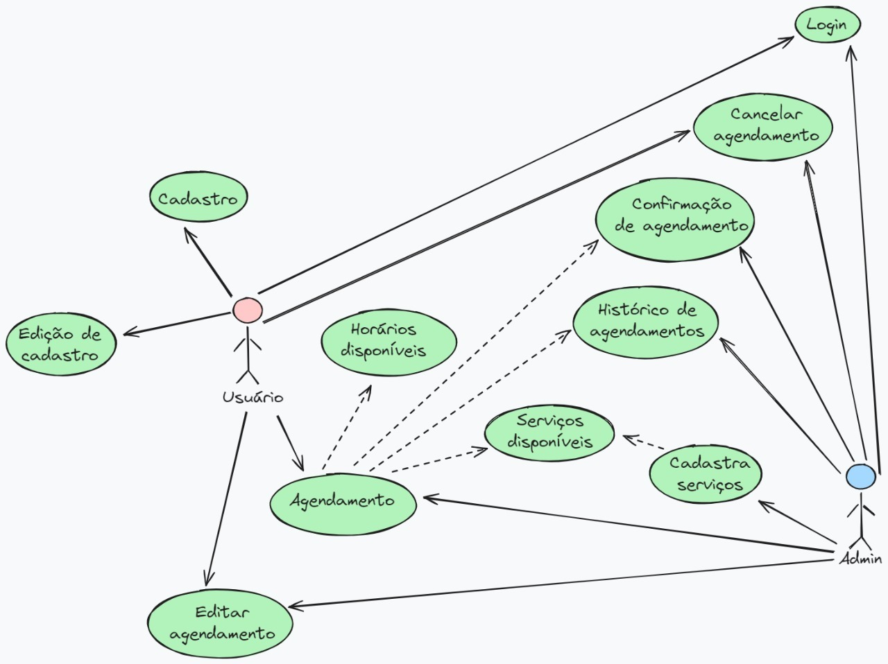

# Apresentação da Solução

## Descrição do Cliente

Ewerton Feitoza é um empreendedor e profissional **talentoso** que sempre foi apaixonado por cuidados masculinos. Ele é o fundador e proprietário do Hysteria Studio, uma barbearia de **destaque** voltada para o público masculino que se localizada no estado do Rio de Janeiro, e especializada em serviços de corte de cabelo, barba, sobrancelha e também tatuagens. Ewerton busca constantemente **inovação** e **primoramento** para oferecer aos seus clientes uma **experiência** excepcional.

## Apresentação

<a href="./pdf/Apresentação%20do%20projeto.pdf"> Apresentação do Projeto</a>

## Project Model Canvas

## Diagrama de Caso de Uso
