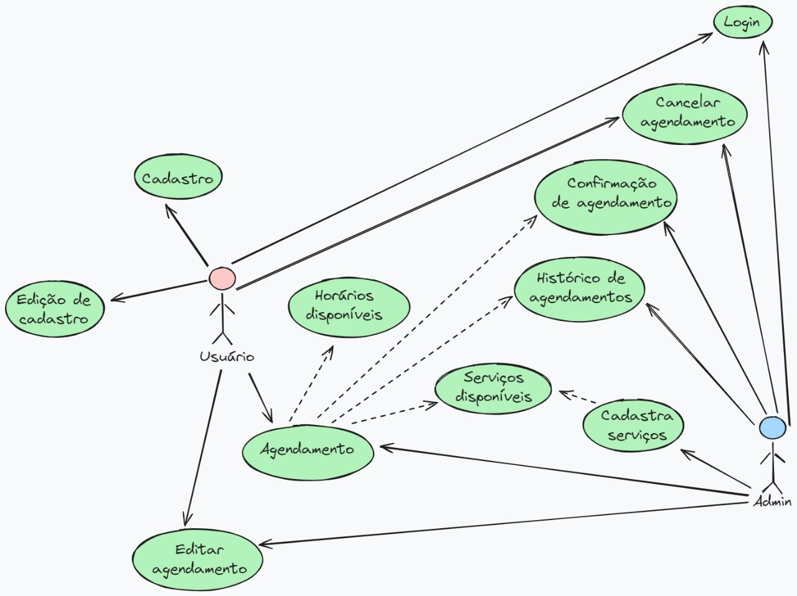

# Especificações do Projeto

Os clientes em diversos setores estão em busca de facilidade e acessibilidade. Nos dias atuais, até as atividades mais simples foram automatizadas, inclusive para o controle e gestão do lojista, essas tecnologias oferecem mais suporte e autonomia. O aplicativo web Hysteria Studio surge para atender às demandas tanto do lojista quanto do cliente, proporcionando facilidade de agendamento e acompanhamento dos serviços oferecidos, incluindo descrição e valores, acessíveis de qualquer lugar. O lojista tem acesso aos agendamentos e pode confirmar ou cancelar as solicitações, além de consultar histórico e filtrar clientes.

## Arquitetura e Tecnologias

Para o gerenciamento de tarefas, será utilizado o Trello. O desenvolvimento do backend será realizado com a linguagem Node.js, que se comunicará com o banco de dados relacional MySQL. Para as interfaces de usuário interativas e dinâmicas, será utilizada a linguagem React.

## Project Model Canvas

Colocar a imagem do modelo construído apresentando a proposta de solução.

> **Links Úteis**:
> Disponíveis em material de apoio do projeto

## Requisitos

### Requisitos Funcionais

| ID     | Descrição do Requisito                                                             | Prioridade |
| ------ | ---------------------------------------------------------------------------------- | ---------- |
| RF-001 | CRUD de serviços.                                                                  | MÉDIA      |
| RF-002 | CRUD de usuários.                                                                  | MÉDIA      |
| RF-003 | CRUD de agenda.                                                                    | MÉDIA      |
| RF-004 | Listagem de histórico.                                                             | MÉDIA      |
| RF-005 | Busca por usuário na listagem de histórico.                                        | MÉDIA      |
| RF-006 | Filtro por data na listagem de histórico.                                          | MÉDIA      |
| RF-007 | O sistema deve fornecer login para admin, para acesso a funcionalidades exclusivas.| MÉDIA      |
| RF-008 | O sistema deve fornecer login para usuário, para acesso às funcionalidades básicas.| MÉDIA      |

### Requisitos não Funcionais

| ID      | Descrição do Requisito                                                                  | Prioridade |
| ------- | --------------------------------------------------------------------------------------- | ---------- |
| RNF-001 | A plataforma deve ser responsiva.                                                       | ALTA       |
| RNF-002 | A plataforma deve ser escalável.                                                        | ALTA       |
| RNF-003 | A aplicação devera ter uma interface para o usuario e uma para o logísta.               | ALTA       |
| RNF-004 | A interface para o usuário será intuitiva e de facíl entendimento para o usuário.       | ALTA       |
| RNF-005 | O sistema deve funcionar em todos os navegadores de uso geral.                          | MÉDIA      |
| RNF-006 | O serviço estará disponivel em servidor para a utilização geral.                        | MÉDIA      |

## Restrições

| ID  | Restrição                                                     |
| --- | ------------------------------------------------------------- |
| 01  | O projeto deverá ser entregue até o final do semestre letivo. |
| 02  | O aplicativo web deve ser construido em React                 |
| 03  | O backend deve ser feito em Node                              |
| 04  | A equipe não pode subcontratar o desenvolvimento do trabalho. |

Enumere as restrições à sua solução. Lembre-se de que as restrições geralmente limitam a solução candidata.

> **Links Úteis**:
>
> - [O que são Requisitos Funcionais e Requisitos Não Funcionais?](https://codificar.com.br/requisitos-funcionais-nao-funcionais/)
> - [O que são requisitos funcionais e requisitos não funcionais?](https://analisederequisitos.com.br/requisitos-funcionais-e-requisitos-nao-funcionais-o-que-sao/)

## Diagrama de Casos de Uso

As referências abaixo irão auxiliá-lo na geração do artefato “Diagrama de Casos de Uso”.

> **Links Úteis**:
>
> - [Criando Casos de Uso](https://www.ibm.com/docs/pt-br/elm/6.0?topic=requirements-creating-use-cases)
> - [Como Criar Diagrama de Caso de Uso: Tutorial Passo a Passo](https://gitmind.com/pt/fazer-diagrama-de-caso-uso.html/)
> - [Lucidchart](https://www.lucidchart.com/)
> - [Astah](https://astah.net/)
> - [Diagrams](https://app.diagrams.net/)

## Modelo ER (Projeto Conceitual)

O Modelo ER representa através de um diagrama como as entidades (coisas, objetos) se relacionam entre si na aplicação interativa.

Sugestão de ferramentas para geração deste artefato: LucidChart e Draw.io.

A referência abaixo irá auxiliá-lo na geração do artefato “Modelo ER”.

> - [Como fazer um diagrama entidade relacionamento | Lucidchart](https://www.lucidchart.com/pages/pt/como-fazer-um-diagrama-entidade-relacionamento)

## Projeto da Base de Dados

O projeto da base de dados corresponde à representação das entidades e relacionamentos identificadas no Modelo ER, no formato de tabelas, com colunas e chaves primárias/estrangeiras necessárias para representar corretamente as restrições de integridade.
