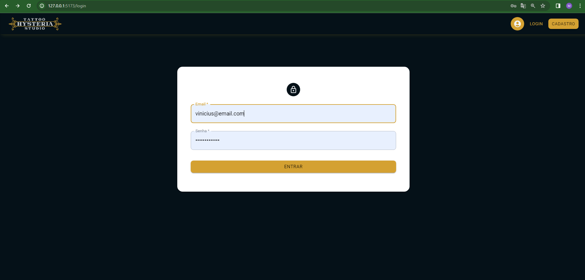
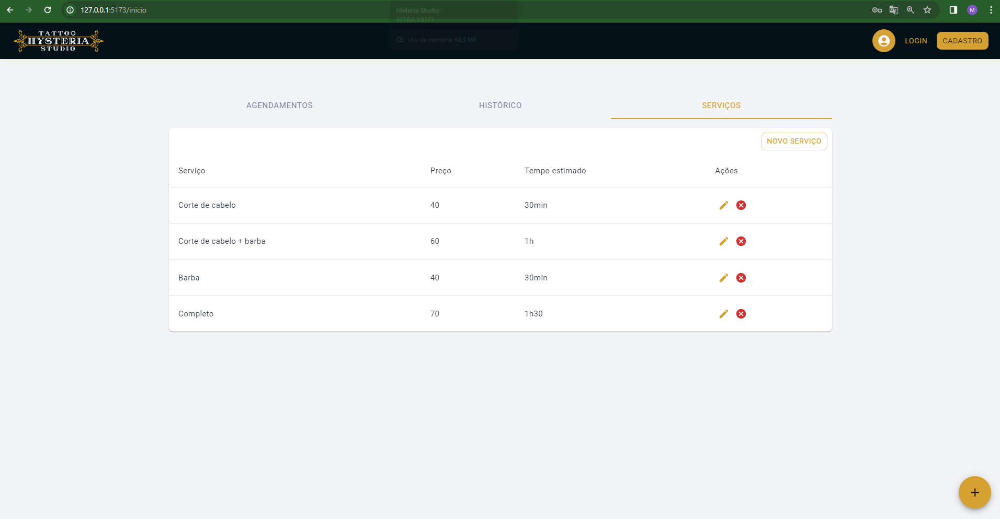
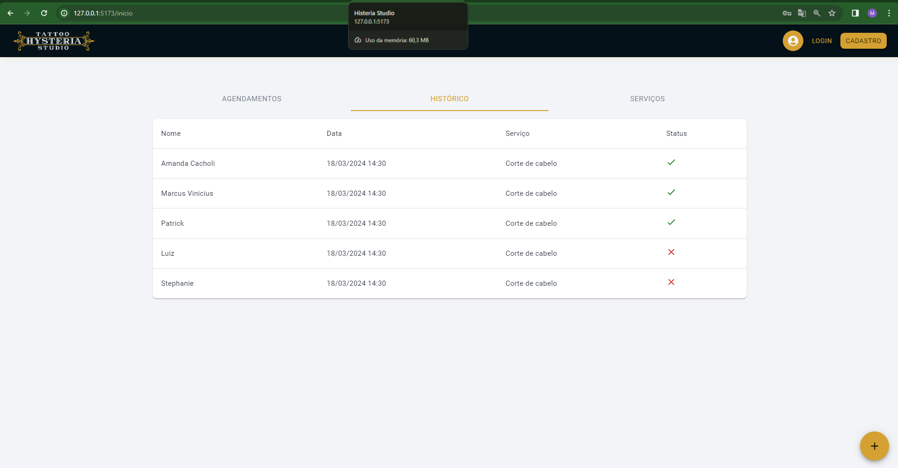
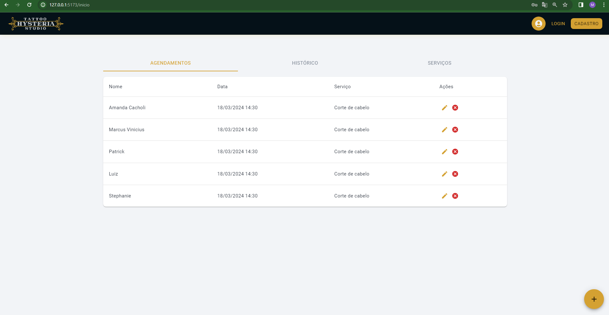
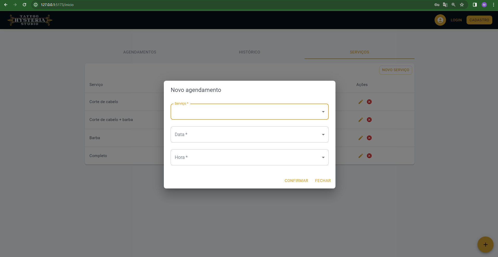

# Planos de Testes de Software

Testes aplicação back-end:

# BACK-END  
Testes aplicação back-end:  

Clique aqui em <a href="../src/web-api/README.md"> API - HYSTERIA </a> para iniciar a aplicação backend.  

Dentro da documentação, vai conter o comando: 
npm test
 Assim que a aplicação estiver rodando, usando esse comando no mesmo diretorio, porém em outro terminal, irá rodar os testes unitarios na aplicação.

  
 
# Evidências de Testes de Software (BACKEND ROTAS)

## Testes de Agenda 

###  Listar agenda

###  Buscar agenda por ID

###  Criar agenda

## Testes de Usuario

###  Criar Usuario

###  Login Admin

## Testes de Serviços 

###  Listar Serviços

###  Buscar Serviço por ID

###  Criar Serviço

# Evidências de Testes de Software (FRONTEND)
# FRONT-END WEB
Está seção detalha o planejamentos do processo de realização dos Testes de Software FRONT-END WEB.
|Caso de Teste | CT-01 - Funcionamento da API para os usuários.|
|:--|:--|
|**Requisitos Associados**|RF-001 - A aplicação deverá permitir o cadastro de usuários e suas informações, sendo separados em autônomos ou solicitante do serviço.   RF-002 - A aplicação deverá permitir a alteração dos dados do usuário.   RF-003 - A aplicação deverá permitir a exclusão dos dados do usuário.   RF-004 - A aplicação deverá exibir os dados do usuário.|
|**Objetivo do teste**| Verificar e testar o cadastro dos usuários juntamente com outras funcionalidades CRUD (Create, Read, Update, Delete). |
|**Passos**|1 - Incluir dados no Banco de Dados NoSQL através da rota pré-definida.  2 - Alterar dados no Banco de Dados NoSQL através da rota pré-definida. 3 - Excluir dados no Banco de Dados NoSQL através da rota pré-definida.   4 - Listar dados no Banco de Dados NoSQL através da rota pré-definida.|
|**Critérios de Êxito**| Os usuários e suas informações devem ser cadastrados com sucesso e a aplicação deverá permitir a manipulação de seus dados conforme expecificado com êxito através das rotas. |

|Caso de Teste | CT-02 - Funcionamento da interface do usuário(logado) com os funcionamentos do lado do servidor. |
|:--|:--|
|**Requisitos Associados**|RF-005 - Poderá acessar a lista de autônomos verificando o serviço prestado   RF-006 - Poderá acessar a opção para adicionar comentariós sobre o prestador   RF-007 - Poderá acessar a opão para verificar suas informações.  RF-008 - Poderá acessar a opção de editar dados, que irá permitir editar seus dados pessoais ou excluir conta.
|**Objetivo do teste**|Verificar o funcionamento da aplicação para usuários já logados e as funcionalidades que o usuário poderá realizar, utilizando o lado do cliente e do servidor. |
|**Passos**| 1 - Acessar a aplicação  2 - realizar o login com uma conta já cadastrada  3 - acessar as opções no menu  4 - Verificar prestadores e seu serviço |
|**Critérios de Êxito**| Possuir uma integração do lado do servidor e do cliente com requisições-respostas através das rotas definidas na API. O usuário conseguirá realizar todas as funcionaliades descritas com êxito desde que utilizadas corretamente, caso não bem utilizadas deverá ser exibida mesnagens de aviso para o usuário. |

## Exibição principal

###  Login

###  Listagem de serviços

###  Listagem de historico

###  Listagem de agendamento

###  Criar Agendamento

