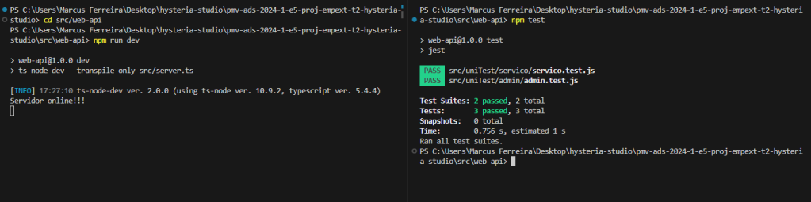
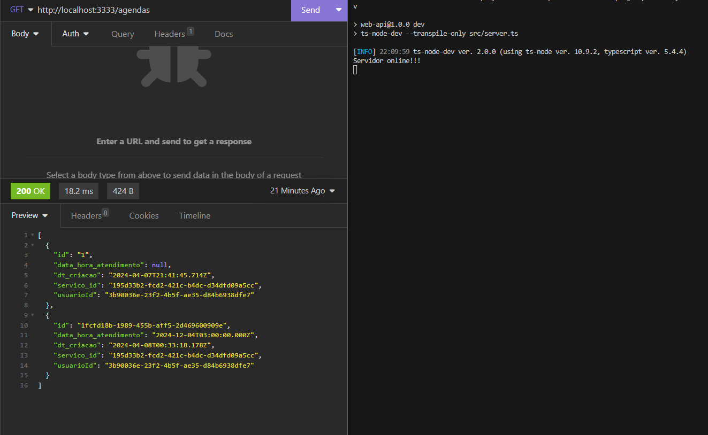
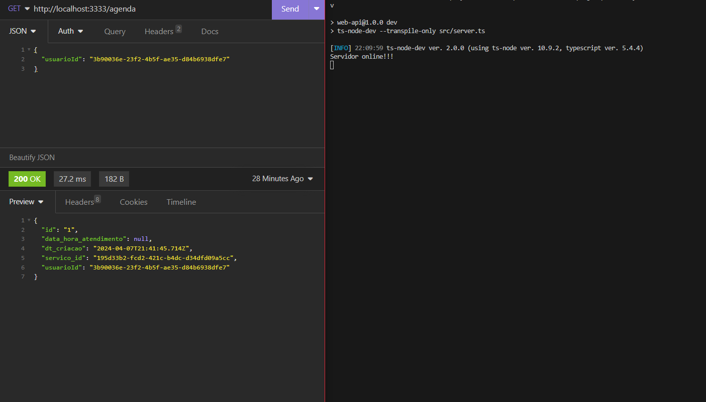
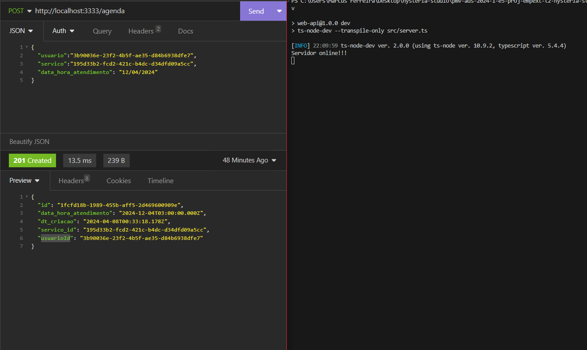
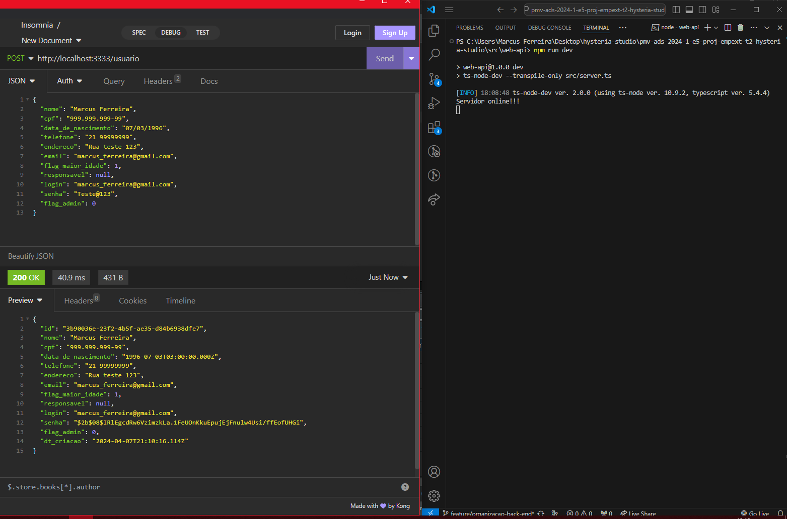
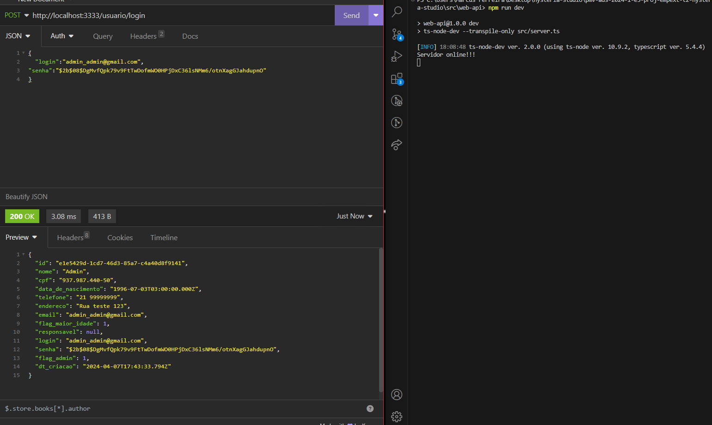
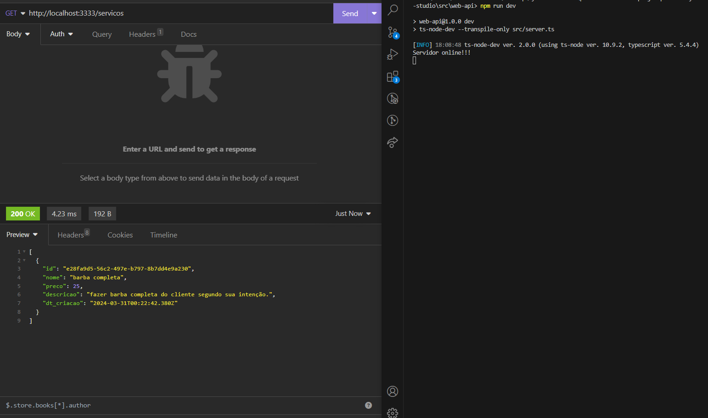
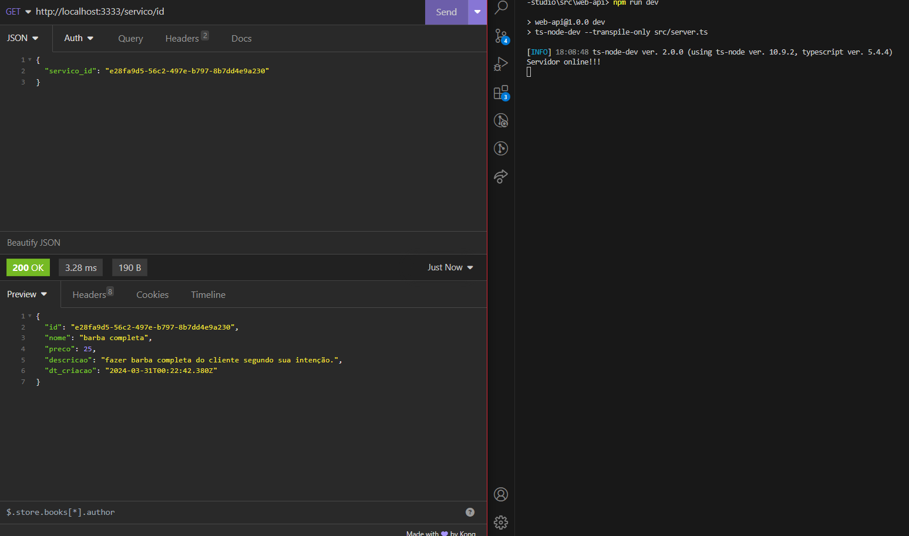
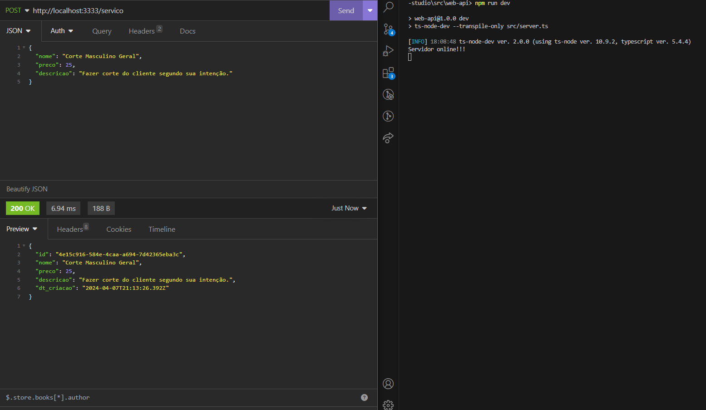

# Planos de Testes de Software

Testes aplicação back-end:

# BACK-END  
Testes aplicação back-end:  

Clique aqui em <a href="../src/web-api/README.md"> API - AJUDA AÍ </a> para iniciar a aplicação backend.  

Dentro da documentação, vai conter o comando: 
npm test
 Assim que a aplicação estiver rodando, usando esse comando no mesmo diretorio, porém em outro terminal, irá rodar os testes unitarios na aplicação.

  
 
# Evidências de Testes de Software

## Testes de Agenda 

###  Listar agenda

###  Buscar agenda por ID

###  Criar agenda

## Testes de Usuario

###  Criar Usuario

###  Login Admin

## Testes de Serviços 

###  Listar Serviços

###  Buscar Serviço por ID

###  Criar Serviço

